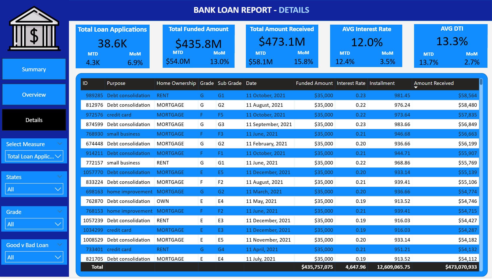
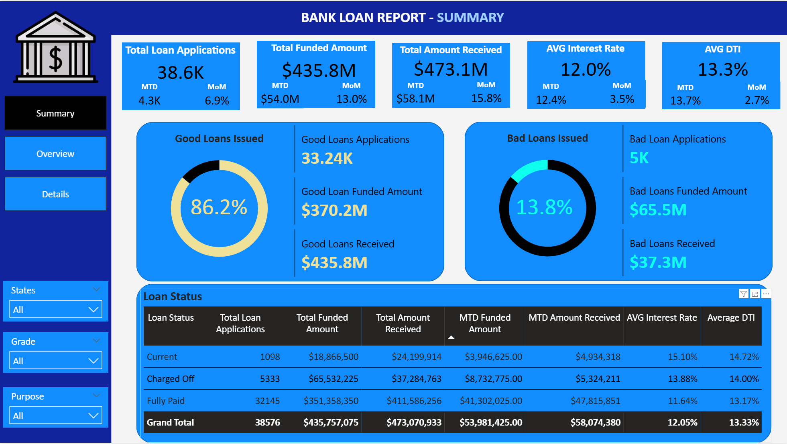
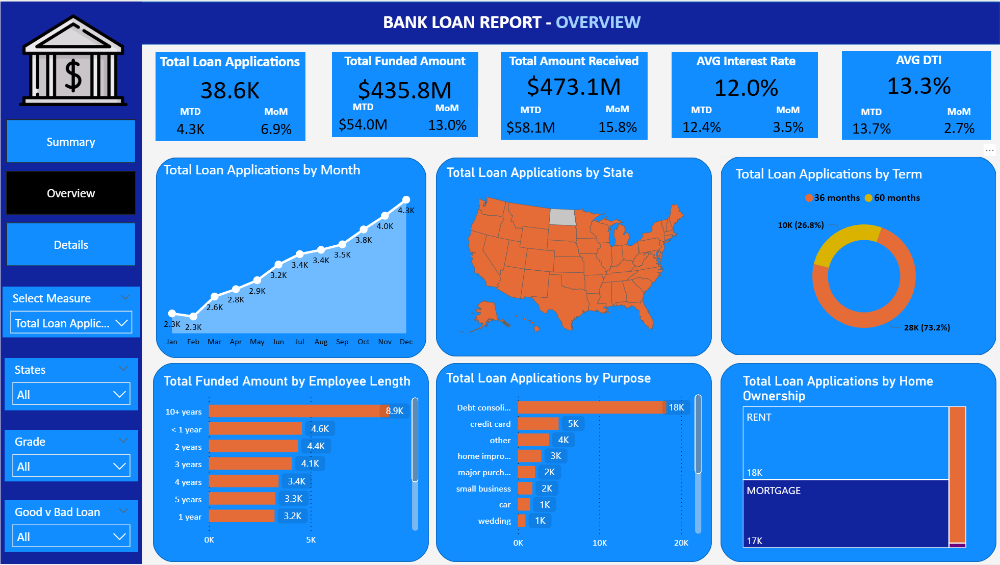

# Bank Loan Portfolio Analysis (Power BI + SQL)

This project analyzes a financial loan dataset to provide data-driven insights into a bank's lending performance. SQL was used for data transformation and KPI generation, and Power BI was used to build an interactive and executive-ready dashboard.

## Tools Used
- Microsoft Power BI
- SQL (MS SQL Server syntax)
- Excel
- DAX

## Project Goals
- Track total applications, funded amounts, and repayments month-to-month
- Classify loans into “Good” vs “Bad” based on repayment status
- Understand trends across loan purpose, term, geography, employment length, and home ownership
- Provide insights to improve loan strategy and reduce default risk

## Key Features
- **KPI Cards:** Total loans, MTD funded/received, average interest rate, average DTI
- **Line Chart:** Monthly trend of applications and repayments
- **Map:** Loan activity by U.S. state
- **Donut Chart:** Loan terms (36/60 months)
- **Bar Charts:** Breakdown by loan purpose and employment length
- **Tree Map:** Home ownership analysis
- **Loan Status Grid View:** Visual snapshot of good vs bad loans

## SQL Highlights
- Used `GROUP BY`, `CASE`, and conditional filtering for KPI segmentation
- Created MoM comparisons using `MONTH(issue_date)` logic
- Wrote region and term-specific aggregations to drive Power BI visuals

## Power BI Dashboard Preview
### 1. Details Page
Provides a comprehensive view of each loan, showing borrower details, loan amount, repayment progress, and financial metrics.

### 2. Summary Page
Displays key KPIs such as total applications, funded amounts, and loan health (good vs bad loans) with filters and MTD breakdowns.

### 3. Overview Page
Visualizes trends by month, region, loan purpose, term length, and borrower employment status using charts and maps.

## Files Included
- `Bank Loan Visualization.pbix` – Complete Power BI file
- `SQL Queries.sql` – All raw queries used
- `financial_loan.csv` – Dataset (scrubbed sample)
- `Problem Statement.pdf` – Original goal & KPI descriptions
